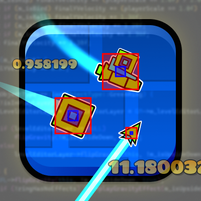

# Open Source GD Project (work in progress)

  

### **Manually verified reconstructions of Geometry Dash functions for modders**

Welcome to the Open Source Geometry Dash Project. This is (hopefully) what I plan to be the most reliable source of information for reverse-engineered function implementations. Basically, I like wasting hours of my spare time and making myself suffer just so I can help the GD modding community. You're welcome 😉.

**What makes my recontructions stand out from others**
- I rename incorrect or imprecise variables from bindings
- I manually verify every function with minimal use of AI
- I override the original and test my reconstruction in-game as proof
- I recover the original intent behind the implementation
- I provide a detailed description of at the top of every function
- I don't post a bunch of slop

*Note: you often see me renaming member variables from bindings - thats' because some of them are incorrectly named. A list of renamed variables can be found in [the markdown file](./RENAMED_BINDINGS.md)*.

---
**Contribution:**

If you are in need of a function's code, or want to simply request an addition, please open a PR or message me on discord at @starrydawn72. All pull requests will go through manual confirmation before being added to the repository.

---
**Info:**
- Game version: 2.2081
- Software used for reversing: [Hex-Rays IDA Professional 9.3 (With BromaIDA for symbols)](https://hex-rays.com/ida-pro)

---

### **Shortcut links to entries per class**

	
[ <b>AnimatedShopKeeper (Complete)</b> ] (5)

	<ul>
		<li><a href="./src/AnimatedShopKeeper/animationFinished.cpp">animationFinished</a></li>
		<li><a href="./src/AnimatedShopKeeper/create.cpp">create</a></li>
		<li><a href="./src/AnimatedShopKeeper/init.cpp">init</a></li>
		<li><a href="./src/AnimatedShopKeeper/playReactAnimation.cpp">playReactAnimation</a></li>
		<li><a href="./src/AnimatedShopKeeper/startAnimating.cpp">startAnimating</a></li>
	</ul>

	
[ <b>AudioEffectsLayer</b> ] (1)

	<ul>
		<li><a href="./src/AudioEffectsLayer/audioStep.cpp">audioStep</a></li>
	</ul>

	
[ <b>CCCircleWave (Complete)</b> ] (10)

	<ul>
		<li><a href="./src/CCCircleWave/baseSetup.cpp">baseSetup</a></li>
		<li><a href="./src/CCCircleWave/create.cpp">create</a></li>
		<li><a href="./src/CCCircleWave/draw.cpp">draw</a></li>
		<li><a href="./src/CCCircleWave/followObject.cpp">followObject</a></li>
		<li><a href="./src/CCCircleWave/init.cpp">init</a></li>
		<li><a href="./src/CCCircleWave/removeMeAndCleanup.cpp">removeMeAndCleanup</a></li>
		<li><a href="./src/CCCircleWave/setPosition.cpp">setPosition</a></li>
		<li><a href="./src/CCCircleWave/updatePosition.cpp">updatePosition</a></li>
		<li><a href="./src/CCCircleWave/updateTweenAction.cpp">updateTweenAction</a></li>
		<li><a href="./src/CCCircleWave/~CCCircleWave.cpp">~CCCircleWave</a></li>
	</ul>

	
[ <b>CCCircleWaveDelegate (Complete)</b> ] (1)

	<ul>
		<li><a href="./src/CCCircleWaveDelegate/circleWaveWillBeRemoved.cpp">circleWaveWillBeRemoved</a></li>
	</ul>

	
[ <b>EditorUI</b> ] (1)

	<ul>
		<li><a href="./src/EditorUI/deselectObject.cpp">deselectObject</a></li>
	</ul>

	
[ <b>GameLevelManager</b> ] (1)

	<ul>
		<li><a href="./src/GameLevelManager/downloadLevel.cpp">downloadLevel</a></li>
	</ul>

	
[ <b>GameObject</b> ] (2)

	<ul>
		<li><a href="./src/GameObject/createAndAddParticle.cpp">createAndAddParticle</a></li>
		<li><a href="./src/GameObject/slopeYPos.cpp">slopeYPos</a></li>
	</ul>

	
[ <b>LevelEditorLayer</b> ] (1)

	<ul>
		<li><a href="./src/LevelEditorLayer/addObjectFromVector.cpp">addObjectFromVector</a></li>
	</ul>

	
[ <b>PlayerObject</b> ] (33)

	<ul>
		<li><a href="./src/PlayerObject/addToYVelocity.cpp">addToYVelocity</a></li>
		<li><a href="./src/PlayerObject/boostPlayer.cpp">boostPlayer</a></li>
		<li><a href="./src/PlayerObject/checkSnapJumpToObject.cpp">checkSnapJumpToObject</a></li>
		<li><a href="./src/PlayerObject/collidedWithSlopeInternal.cpp">collidedWithSlopeInternal</a></li>
		<li><a href="./src/PlayerObject/flipMod.cpp">flipMod</a></li>
		<li><a href="./src/PlayerObject/getModifiedSlopeYVel.cpp">getModifiedSlopeYVel</a></li>
		<li><a href="./src/PlayerObject/getObjectRotation.cpp">getObjectRotation</a></li>
		<li><a href="./src/PlayerObject/isFlying.cpp">isFlying</a></li>
		<li><a href="./src/PlayerObject/isSafeFlip.cpp">isSafeFlip</a></li>
		<li><a href="./src/PlayerObject/isSafeMode.cpp">isSafeMode</a></li>
		<li><a href="./src/PlayerObject/levelFlipFinished.cpp">levelFlipFinished</a></li>
		<li><a href="./src/PlayerObject/levelFlipping.cpp">levelFlipping</a></li>
		<li><a href="./src/PlayerObject/levelWillFlip.cpp">levelWillFlip</a></li>
		<li><a href="./src/PlayerObject/limitDashRotation.cpp">limitDashRotation</a></li>
		<li><a href="./src/PlayerObject/playBumpEffect.cpp">playBumpEffect</a></li>
		<li><a href="./src/PlayerObject/playerIsFalling.cpp">playerIsFalling</a></li>
		<li><a href="./src/PlayerObject/playerIsFallingBugged.cpp">playerIsFallingBugged</a></li>
		<li><a href="./src/PlayerObject/playSpawnEffect.cpp">playSpawnEffect</a></li>
		<li><a href="./src/PlayerObject/preSlopeCollision.cpp">preSlopeCollision</a></li>
		<li><a href="./src/PlayerObject/pushDown.cpp">pushDown</a></li>
		<li><a href="./src/PlayerObject/pushPlayer.cpp">pushPlayer</a></li>
		<li><a href="./src/PlayerObject/redirectDash.cpp">redirectDash</a></li>
		<li><a href="./src/PlayerObject/reverseMod.cpp">reverseMod</a></li>
		<li><a href="./src/PlayerObject/ringJump.cpp">ringJump</a></li>
		<li><a href="./src/PlayerObject/runBallRotation.cpp">runBallRotation</a></li>
		<li><a href="./src/PlayerObject/runBallRotation2.cpp">runBallRotation2</a></li>
		<li><a href="./src/PlayerObject/runNormalRotation.cpp">runNormalRotation</a></li>
		<li><a href="./src/PlayerObject/setYVelocity.cpp">setYVelocity</a></li>
		<li><a href="./src/PlayerObject/spawnPortalCircle.cpp">spawnPortalCircle</a></li>
		<li><a href="./src/PlayerObject/stopRotation.cpp">stopRotation</a></li>
		<li><a href="./src/PlayerObject/updateSlopeRotation.cpp">updateSlopeRotation</a></li>
		<li><a href="./src/PlayerObject/updateSlopeYVelocity.cpp">updateSlopeYVelocity</a></li>
		<li><a href="./src/PlayerObject/updateTimeMod.cpp">updateTimeMod</a></li>
	</ul>

	
[ <b>PlayLayer</b> ] (2)

	<ul>
		<li><a href="./src/PlayLayer/circleWaveWillBeRemoved.cpp">circleWaveWillBeRemoved</a></li>
		<li><a href="./src/PlayLayer/updateVisibility.cpp">updateVisibility</a></li>
	</ul>

	
[ <b>RingObject</b> ] (2)

	<ul>
		<li><a href="./src/RingObject/powerOnObject.cpp">powerOnObject</a></li>
		<li><a href="./src/RingObject/spawnCircle.cpp">spawnCircle</a></li>
	</ul>

	
[ <b>Other</b> ] (1)

	<ul>
		<li><a href="./src/FreeFunctions.cpp">Free Functions</a></li>
	</ul>

