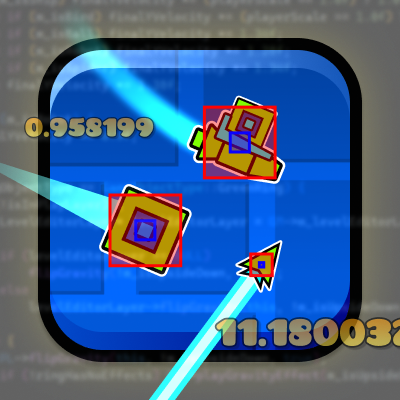

# Open Source GD Project (work in progress)

  

### **Manually verified reconstructions of Geometry Dash functions for modders**

Welcome to the Open Source Geometry Dash Project. This is (hopefully) what I plan to be the most reliable source of information for reverse-engineered function implementations. Basically, I like wasting hours of my spare time and making myself suffer just so I can help the GD modding community.

**About my work**
- I manually verify every function with minimal use of AI
- I override the original and test my reconstruction in-game as proof
- I don't post a bunch of slop

*Note: you often see me renaming member variables from bindings - thats' because some of them are incorrectly named. A list of renamed variables can be found in [the markdown file](./RENAMED_BINDINGS.md)*.

---
**Contribution:**

If you are in need of a function's code that isn't already on this list, or want to simply request an addition, please open a PR or message me on discord at @starrydawn72. All pull requests will go through manual confirmation before being added to the repository.

---
**Info:**
- Game version: 2.2081
- Software used for reversing: [Hex-Rays IDA Professional 9.3 (With BromaIDA for symbols)](https://hex-rays.com/ida-pro)

---

### **Shortcut links to entries per class**

	
[ <b>AnimatedShopKeeper (Complete)</b> ] (5)

	<ul>
		<li><a href="./src/AnimatedShopKeeper/animationFinished.cpp">animationFinished</a></li>
		<li><a href="./src/AnimatedShopKeeper/create.cpp">create</a></li>
		<li><a href="./src/AnimatedShopKeeper/init.cpp">init</a></li>
		<li><a href="./src/AnimatedShopKeeper/playReactAnimation.cpp">playReactAnimation</a></li>
		<li><a href="./src/AnimatedShopKeeper/startAnimating.cpp">startAnimating</a></li>
	</ul>

	
[ <b>AudioEffectsLayer</b> ] (1)

	<ul>
		<li><a href="./src/AudioEffectsLayer/audioStep.cpp">audioStep</a></li>
	</ul>

	
[ <b>CCCircleWave (Complete)</b> ] (11)

	<ul>
		<li><a href="./src/CCCircleWave/baseSetup.cpp">baseSetup</a></li>
		<li><a href="./src/CCCircleWave/CCCircleWave.cpp">CCCircleWave</a></li>
		<li><a href="./src/CCCircleWave/create.cpp">create</a></li>
		<li><a href="./src/CCCircleWave/draw.cpp">draw</a></li>
		<li><a href="./src/CCCircleWave/followObject.cpp">followObject</a></li>
		<li><a href="./src/CCCircleWave/init.cpp">init</a></li>
		<li><a href="./src/CCCircleWave/removeMeAndCleanup.cpp">removeMeAndCleanup</a></li>
		<li><a href="./src/CCCircleWave/setPosition.cpp">setPosition</a></li>
		<li><a href="./src/CCCircleWave/updatePosition.cpp">updatePosition</a></li>
		<li><a href="./src/CCCircleWave/updateTweenAction.cpp">updateTweenAction</a></li>
		<li><a href="./src/CCCircleWave/~CCCircleWave.cpp">~CCCircleWave</a></li>
	</ul>

	
[ <b>CCCircleWaveDelegate (Complete)</b> ] (1)

	<ul>
		<li><a href="./src/CCCircleWaveDelegate/circleWaveWillBeRemoved.cpp">circleWaveWillBeRemoved</a></li>
	</ul>

	
[ <b>EditorUI</b> ] (1)

	<ul>
		<li><a href="./src/EditorUI/deselectObject.cpp">deselectObject</a></li>
	</ul>

	
[ <b>GameLevelManager</b> ] (1)

	<ul>
		<li><a href="./src/GameLevelManager/downloadLevel.cpp">downloadLevel</a></li>
	</ul>

	
[ <b>GameObject</b> ] (2)

	<ul>
		<li><a href="./src/GameObject/createAndAddParticle.cpp">createAndAddParticle</a></li>
		<li><a href="./src/GameObject/slopeYPos.cpp">slopeYPos</a></li>
	</ul>

	
[ <b>GJBaseGameLayer</b> ] (1)

	<ul>
		<li><a href="./src/GJBaseGameLayer/collisionCheckObjects.cpp">collisionCheckObjects</a></li>
	</ul>

	
[ <b>LevelEditorLayer</b> ] (2)

	<ul>
		<li><a href="./src/LevelEditorLayer/addObjectFromVector.cpp">addObjectFromVector</a></li>
		<li><a href="./src/LevelEditorLayer/updateVisibility.cpp">updateVisibility</a></li>
	</ul>

	
[ <b>PlayerObject</b> ] (111)

	<ul>
		<li><a href="./src/PlayerObject/activateStreak.cpp">activateStreak</a></li>
		<li><a href="./src/PlayerObject/addAllParticles.cpp">addAllParticles</a></li>
		<li><a href="./src/PlayerObject/addToTouchedRings.cpp">addToTouchedRings</a></li>
		<li><a href="./src/PlayerObject/addToYVelocity.cpp">addToYVelocity</a></li>
		<li><a href="./src/PlayerObject/animationFinished.cpp">animationFinished</a></li>
		<li><a href="./src/PlayerObject/boostPlayer.cpp">boostPlayer</a></li>
		<li><a href="./src/PlayerObject/canStickToGround.cpp">canStickToGround</a></li>
		<li><a href="./src/PlayerObject/checkSnapJumpToObject.cpp">checkSnapJumpToObject</a></li>
		<li><a href="./src/PlayerObject/collidedWithObject.cpp">collidedWithObject</a></li>
		<li><a href="./src/PlayerObject/collidedWithSlope.cpp">collidedWithSlope</a></li>
		<li><a href="./src/PlayerObject/collidedWithSlopeInternal.cpp">collidedWithSlopeInternal</a></li>
		<li><a href="./src/PlayerObject/create.cpp">create</a></li>
		<li><a href="./src/PlayerObject/deactivateParticle.cpp">deactivateParticle</a></li>
		<li><a href="./src/PlayerObject/deactivateStreak.cpp">deactivateStreak</a></li>
		<li><a href="./src/PlayerObject/destroyFromHitHead.cpp">destroyFromHitHead</a></li>
		<li><a href="./src/PlayerObject/didHitHead.cpp">didHitHead</a></li>
		<li><a href="./src/PlayerObject/exitPlatformerAnimateJump.cpp">exitPlatformerAnimateJump</a></li>
		<li><a href="./src/PlayerObject/fadeOutStreak2.cpp">fadeOutStreak2</a></li>
		<li><a href="./src/PlayerObject/flipGravity.cpp">flipGravity</a></li>
		<li><a href="./src/PlayerObject/flipMod.cpp">flipMod</a></li>
		<li><a href="./src/PlayerObject/gameEventTriggered.cpp">gameEventTriggered</a></li>
		<li><a href="./src/PlayerObject/getActiveMode.cpp">getActiveMode</a></li>
		<li><a href="./src/PlayerObject/getCurrentXVelocity.cpp">getCurrentXVelocity</a></li>
		<li><a href="./src/PlayerObject/getModifiedSlopeYVel.cpp">getModifiedSlopeYVel</a></li>
		<li><a href="./src/PlayerObject/getObjectRotation.cpp">getObjectRotation</a></li>
		<li><a href="./src/PlayerObject/getOrientedBox.cpp">getOrientedBox</a></li>
		<li><a href="./src/PlayerObject/getRealPosition.cpp">getRealPosition</a></li>
		<li><a href="./src/PlayerObject/getSecondColor.cpp">getSecondColor</a></li>
		<li><a href="./src/PlayerObject/getYVelocity.cpp">getYVelocity</a></li>
		<li><a href="./src/PlayerObject/gravityDown.cpp">gravityDown</a></li>
		<li><a href="./src/PlayerObject/gravityUp.cpp">gravityUp</a></li>
		<li><a href="./src/PlayerObject/hardFlipGravity.cpp">hardFlipGravity</a></li>
		<li><a href="./src/PlayerObject/hitGroundNoJump.cpp">hitGroundNoJump</a></li>
		<li><a href="./src/PlayerObject/incrementJumps.cpp">incrementJumps</a></li>
		<li><a href="./src/PlayerObject/isBoostValid.cpp">isBoostValid</a></li>
		<li><a href="./src/PlayerObject/isFlying.cpp">isFlying</a></li>
		<li><a href="./src/PlayerObject/isInBasicMode.cpp">isInBasicMode</a></li>
		<li><a href="./src/PlayerObject/isInNormalMode.cpp">isInNormalMode</a></li>
		<li><a href="./src/PlayerObject/isSafeFlip.cpp">isSafeFlip</a></li>
		<li><a href="./src/PlayerObject/isSafeHeadTest.cpp">isSafeHeadTest</a></li>
		<li><a href="./src/PlayerObject/isSafeMode.cpp">isSafeMode</a></li>
		<li><a href="./src/PlayerObject/levelFlipFinished.cpp">levelFlipFinished</a></li>
		<li><a href="./src/PlayerObject/levelFlipping.cpp">levelFlipping</a></li>
		<li><a href="./src/PlayerObject/levelWillFlip.cpp">levelWillFlip</a></li>
		<li><a href="./src/PlayerObject/limitDashRotation.cpp">limitDashRotation</a></li>
		<li><a href="./src/PlayerObject/lockPlayer.cpp">lockPlayer</a></li>
		<li><a href="./src/PlayerObject/logValues.cpp">logValues</a></li>
		<li><a href="./src/PlayerObject/modeDidChange.cpp">modeDidChange</a></li>
		<li><a href="./src/PlayerObject/playBumpEffect.cpp">playBumpEffect</a></li>
		<li><a href="./src/PlayerObject/playBurstEffect.cpp">playBurstEffect</a></li>
		<li><a href="./src/PlayerObject/playerIsFalling.cpp">playerIsFalling</a></li>
		<li><a href="./src/PlayerObject/playerIsFallingBugged.cpp">playerIsFallingBugged</a></li>
		<li><a href="./src/PlayerObject/playerIsMovingUp.cpp">playerIsMovingUp</a></li>
		<li><a href="./src/PlayerObject/playerTeleported.cpp">playerTeleported</a></li>
		<li><a href="./src/PlayerObject/playingEndEffect.cpp">playingEndEffect</a></li>
		<li><a href="./src/PlayerObject/playSpawnEffect.cpp">playSpawnEffect</a></li>
		<li><a href="./src/PlayerObject/preSlopeCollision.cpp">preSlopeCollision</a></li>
		<li><a href="./src/PlayerObject/pushDown.cpp">pushDown</a></li>
		<li><a href="./src/PlayerObject/pushPlayer.cpp">pushPlayer</a></li>
		<li><a href="./src/PlayerObject/redirectDash.cpp">redirectDash</a></li>
		<li><a href="./src/PlayerObject/removeAllParticles.cpp">removeAllParticles</a></li>
		<li><a href="./src/PlayerObject/resetAllParticles.cpp">resetAllParticles</a></li>
		<li><a href="./src/PlayerObject/resetCollisionValues.cpp">resetCollisionValues</a></li>
		<li><a href="./src/PlayerObject/resetStreak.cpp">resetStreak</a></li>
		<li><a href="./src/PlayerObject/reverseMod.cpp">reverseMod</a></li>
		<li><a href="./src/PlayerObject/ringJump.cpp">ringJump</a></li>
		<li><a href="./src/PlayerObject/runBallRotation.cpp">runBallRotation</a></li>
		<li><a href="./src/PlayerObject/runBallRotation2.cpp">runBallRotation2</a></li>
		<li><a href="./src/PlayerObject/runNormalRotation.cpp">runNormalRotation</a></li>
		<li><a href="./src/PlayerObject/runRotateAction.cpp">runRotateAction</a></li>
		<li><a href="./src/PlayerObject/setColor.cpp">setColor</a></li>
		<li><a href="./src/PlayerObject/setFlipX.cpp">setFlipX</a></li>
		<li><a href="./src/PlayerObject/setOpacity.cpp">setOpacity</a></li>
		<li><a href="./src/PlayerObject/setRotation.cpp">setRotation</a></li>
		<li><a href="./src/PlayerObject/setScale.cpp">setScale</a></li>
		<li><a href="./src/PlayerObject/setScaleX.cpp">setScaleX</a></li>
		<li><a href="./src/PlayerObject/setScaleY.cpp">setScaleY</a></li>
		<li><a href="./src/PlayerObject/setSecondColor.cpp">setSecondColor</a></li>
		<li><a href="./src/PlayerObject/setVisible.cpp">setVisible</a></li>
		<li><a href="./src/PlayerObject/setYVelocity.cpp">setYVelocity</a></li>
		<li><a href="./src/PlayerObject/spawnCircle.cpp">spawnCircle</a></li>
		<li><a href="./src/PlayerObject/spawnCircle2.cpp">spawnCircle2</a></li>
		<li><a href="./src/PlayerObject/spawnDualCircle.cpp">spawnDualCircle</a></li>
		<li><a href="./src/PlayerObject/spawnPortalCircle.cpp">spawnPortalCircle</a></li>
		<li><a href="./src/PlayerObject/spawnScaleCircle.cpp">spawnScaleCircle</a></li>
		<li><a href="./src/PlayerObject/speedDown.cpp">speedDown</a></li>
		<li><a href="./src/PlayerObject/speedUp.cpp">speedUp</a></li>
		<li><a href="./src/PlayerObject/spiderTestJump.cpp">spiderTestJump</a></li>
		<li><a href="./src/PlayerObject/stopBurstEffect.cpp">stopBurstEffect</a></li>
		<li><a href="./src/PlayerObject/stopParticles.cpp">stopParticles</a></li>
		<li><a href="./src/PlayerObject/stopRotation.cpp">stopRotation</a></li>
		<li><a href="./src/PlayerObject/stopStreak2.cpp">stopStreak2</a></li>
		<li><a href="./src/PlayerObject/togglePlatformerMode.cpp">togglePlatformerMode</a></li>
		<li><a href="./src/PlayerObject/toggleVisibility.cpp">toggleVisibility</a></li>
		<li><a href="./src/PlayerObject/unrotatePreSlopeObjects.cpp">unrotatePreSlopeObjects</a></li>
		<li><a href="./src/PlayerObject/updateCollide.cpp">updateCollide</a></li>
		<li><a href="./src/PlayerObject/updateEffects.cpp">updateEffects</a></li>
		<li><a href="./src/PlayerObject/updateInternalActions.cpp">updateInternalActions</a></li>
		<li><a href="./src/PlayerObject/updateJump.cpp">updateJump</a></li>
		<li><a href="./src/PlayerObject/updatePlayerScale.cpp">updatePlayerScale</a></li>
		<li><a href="./src/PlayerObject/updateRobotAnimationSpeed.cpp">updateRobotAnimationSpeed</a></li>
		<li><a href="./src/PlayerObject/updateRotation.cpp">updateRotation</a></li>
		<li><a href="./src/PlayerObject/updateSlopeRotation.cpp">updateSlopeRotation</a></li>
		<li><a href="./src/PlayerObject/updateSlopeYVelocity.cpp">updateSlopeYVelocity</a></li>
		<li><a href="./src/PlayerObject/updateStreakBlend.cpp">updateStreakBlend</a></li>
		<li><a href="./src/PlayerObject/updateStreaks.cpp">updateStreaks</a></li>
		<li><a href="./src/PlayerObject/updateSwingFire.cpp">updateSwingFire</a></li>
		<li><a href="./src/PlayerObject/updateTimeMod.cpp">updateTimeMod</a></li>
		<li><a href="./src/PlayerObject/usingWallLimitedMode.cpp">usingWallLimitedMode</a></li>
		<li><a href="./src/PlayerObject/yStartDown.cpp">yStartDown</a></li>
		<li><a href="./src/PlayerObject/yStartUp.cpp">yStartUp</a></li>
	</ul>

	
[ <b>PlayLayer</b> ] (3)

	<ul>
		<li><a href="./src/PlayLayer/circleWaveWillBeRemoved.cpp">circleWaveWillBeRemoved</a></li>
		<li><a href="./src/PlayLayer/getRelativeModNew.cpp">getRelativeModNew</a></li>
		<li><a href="./src/PlayLayer/updateVisibility.cpp">updateVisibility</a></li>
	</ul>

	
[ <b>RingObject</b> ] (2)

	<ul>
		<li><a href="./src/RingObject/powerOnObject.cpp">powerOnObject</a></li>
		<li><a href="./src/RingObject/spawnCircle.cpp">spawnCircle</a></li>
	</ul>

	
[ <b>Other</b> ] (1)

	<ul>
		<li><a href="./src/FreeFunctions.cpp">Free Functions</a></li>
	</ul>

